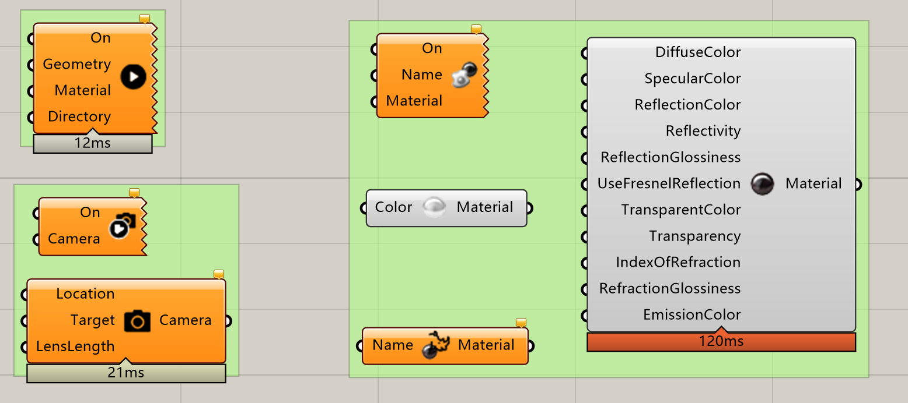

# Animation
This lightweight plug-in helps designers to make better animations with less effort.

Components:

What it can achieve:

- Control viewport. By giving a camera position and a target point, you can easily control the viewport thus moving the camera, or even zoom in zoom out in your video/gif.
- Assign material. Material can be assigned to you objects, so you can have geometries changing color, reflectivity, transparency, etc. in your video/gif.
- Better visualization. This plug-in automatically bakes geometries into rhino environment before saving every frame (and automatically deletes them), so it can achieve all the Rhino visualization effects (proper shading, proper lighting and shadows, clipping planes, etc.) by adjusting your rhino display setting.

3 example files are provided to help understand the work flow.

1. A growing box, changing color, with the camera moving around.  

   

2. Small emerging pieces, with the camera moving around.

   

3. Falling balls, changing color, done together with Kangaroo Physics.

   

Download: https://www.food4rhino.com/app/animation
